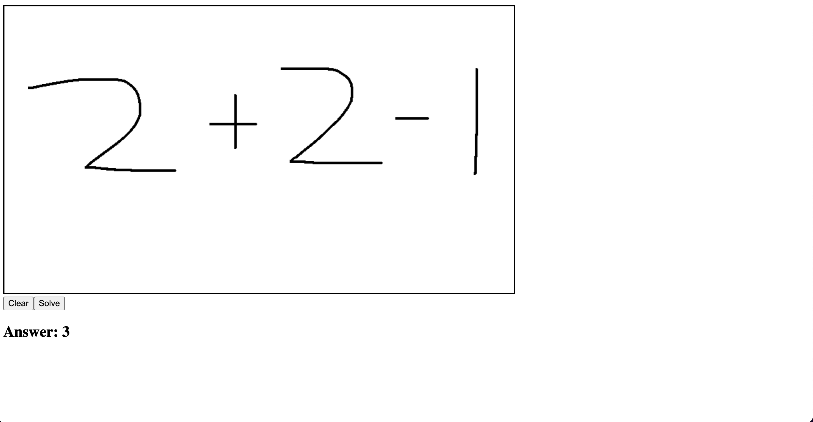

# Hand Written Equation Solver
Used Django, React.js, and Tensorflow to build a REST API to solve hand written equations.

## How to run
1. cd into src, run "python manage.py" runserver
2. open a new terminal
3. cd src/client
4. npm start
5. go to "http://localhost:3000/" in browser

## Dataset 
Link: https://www.kaggle.com/datasets/xainano/handwrittenmathsymbols?sort=votes

Dataset conatins images of hand written math symbols (45x45)

Only used a subset of the data for this project. Used numbers 0-9, +, -, and times.
